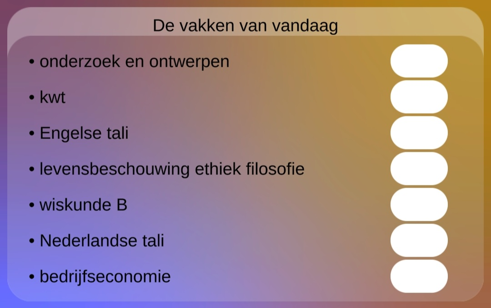

Op deze pagina vind je alle informatie over het hoofd menu.

___
## De vakken van vandaag

Hier word elke dag een nieuwe lijst met gemaakt met de vakken die je die dag hebt. (als jij liever je tas 's avonds inpakt [klik hier](#tijd-van-inpakken-veranderen)). 

___
## De tijd tot...

Hier zie je een aftellende klok die afteld naar de eerstvolgende gebeurtenis. bijv: totdat je moet vertrekken, totdat de volgende les begint of totdat je klaar bent met je lesdag.

___
## Instellingen

#### panelen aan of uit zetten
Als je genoeg hebt van een of meerdere van panelen in het hoofdmenu, dan kan je die gewoon uitzetten door in de instellingen te klikken op 'hoofd menu' en daarna de verschillende panelen aan of uit te zetten.   

#### tijd van inpakken veranderen
Als je liever 's avonds je tas in pakt kan je in de instellingen aanpassen dat je de paklijst de avond van tevoren te zien krijgt. (na 5 uur).
