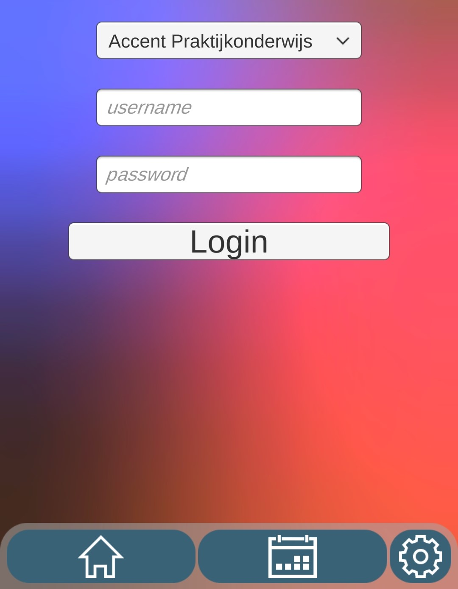

## Inloggen op Somtoday

Als je hebt ingelogd op Zermelo en je meer wilt dan alleen je lessen zien, dan is er de mogelijkheid om in te loggen op Somtoday. Hier is maar één manier voor, omdat Somtoday niet officieel de mogelijkheid geeft voor andere applicaties om data op te vragen, de enige manier om dit te omzeilen is om in te loggen met je echte wachtwoord en gebruikersnaam van somtoday. Dit is natuurlijk eng, maar het heeft heel veel voordelen
1) Je kan je huiswerk bekijken
2) Je kan Cijfers bekijken
3) je kan leermiddelen toevoegen

Dit is natuurlijk heel erg handig én makkelijk te doen, het is namelijk heel erg makkelijk. Inloggen op de app is het bijna het zelfde als inloggen op Somtoday zelf. Dit heeft niet heel veel uitleg meer nodig. dus succes.  
