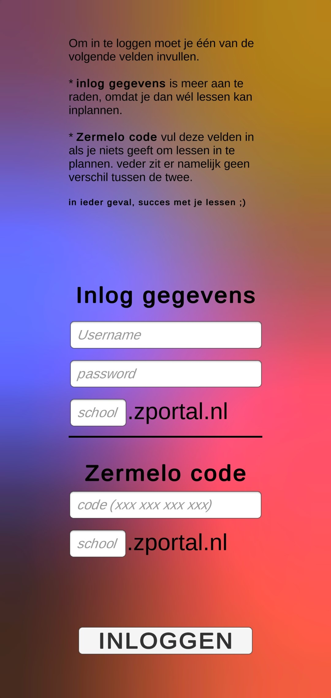

# Inloggen op Zermelo

Als je de app voor de eerste keer opent krijg je dit scherm te zien. 
Hier moet je inloggen op Zermelo, hiervoor heb je 2 manieren.

1) Bij manier 1 vul je je echte Zermelo inlog gegevens in, ('username', 'password', 'school'). Ik snap dat dit misschien een beetje eng is, maar er zit wel een groot voordeel aan vast. Aks je inlog via deze manier kan je namelijk wél lessen inplannen, anders kan dat niet, Dus als je daar niet om geeft kan je lekker kiezen voor de 2de manier.  

2) Bij deze manier hoef je iets minder in te vullen, maar kost wel wat meer tijd. Je moet namelijk een Zermelo code opvragen. Dit doe je op de Zermelo website op je computer ([voor mobiele versie klik hier](#ZermeloCodeMobiel)). [https://[school].zportal.nl/app/]() (de [school] leg ik later in deze pagina uit*). Daarna ga je naar de **webportal** niet de webapp. als je dit hebt gedaan klik je op het deel / 2de icoontje links in het menu. Daarna klik je op 'koppel externe applicatie'. Dan krijg je een 3 letters en een 12 cijferige code op je scherm. vul deze in in de app.
    Op mobiel is het net iets anders. Als je de code op mobiel wilt ophalen. volg dan de volgende stappen: 
   1) log in op zermelo
   2) activeer desktop modus in je browser [meer uitleg](https://helpdeskgeek.com/how-to/how-to-activate-desktop-mode-in-any-browser-on-android-ios)
   3) deel icoontje > koppel applicatie
   4) vul de codes in.
   

*met [school] bedoel ik de 3 letters óf de eerste 3 letters aan het begin van de link als je op zermelo inlogd bijv. https://ccg.zportal.nl. hier is 'ccg' de lettercode. elke school heeft zijn eigen.  
