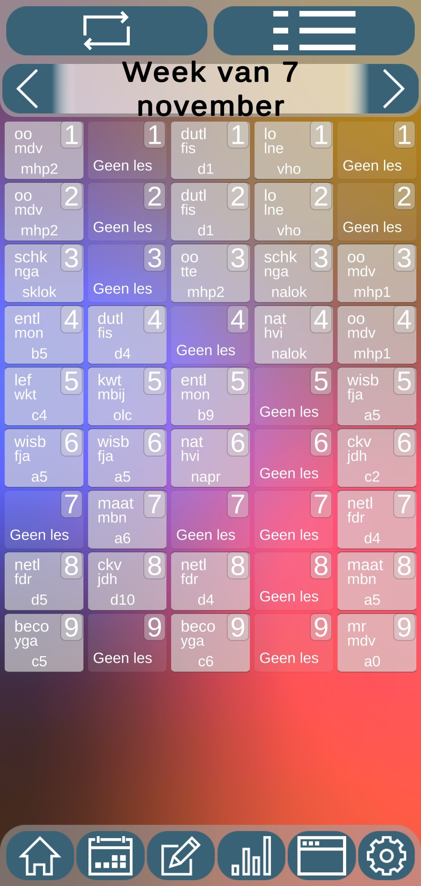

Hier vind je alle informatie over het week rooster. dit laat je lessen zien die de op die dag hebt. Hier kan je ook KWT of andere lessen inplannen als je school dat mogelijk maakt.
Alle informatie is hetzelfde als op het dag rooster, maar dan zie je 5 dagen in een keer. daarom ga ik niet meer uitleggen over het weekrooster. Als je iets wilt weten kijk dan op [dag rooster](DagRooster)
  